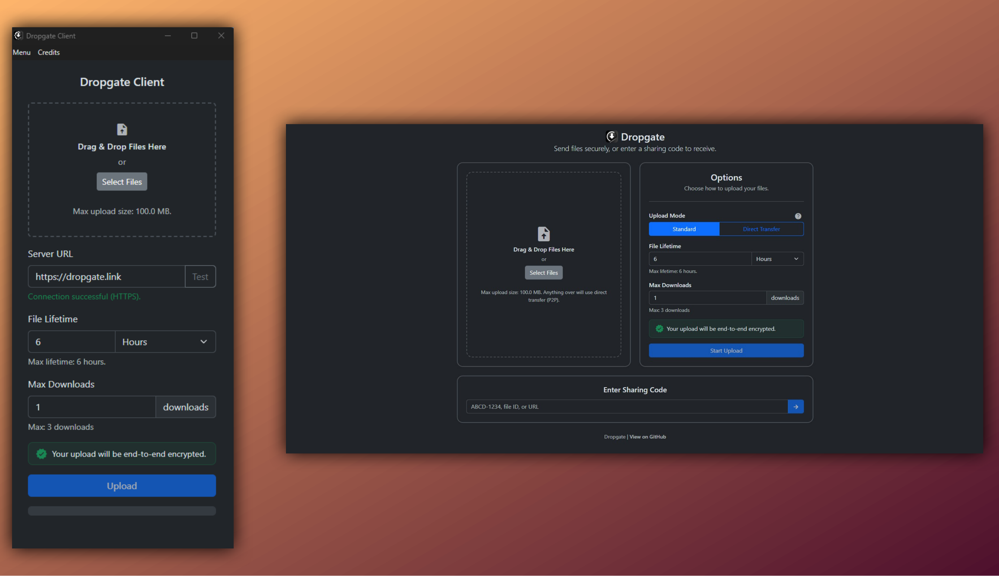
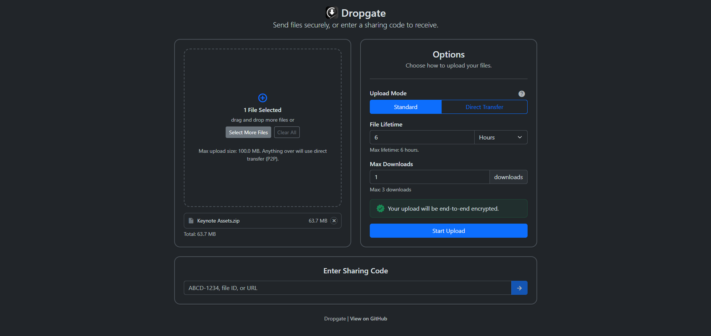
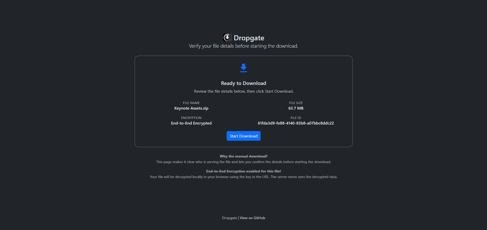
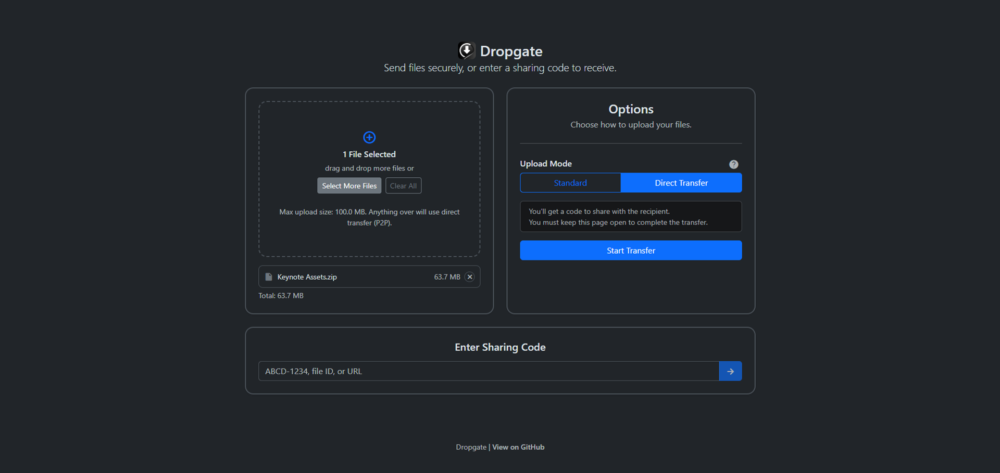
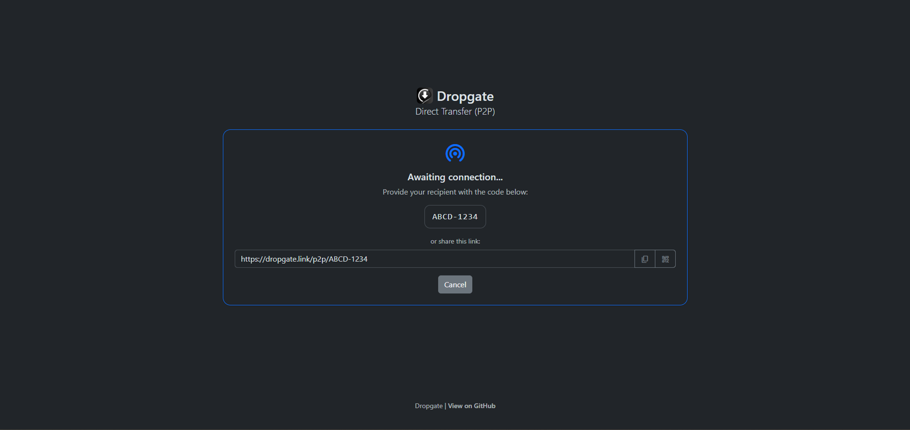
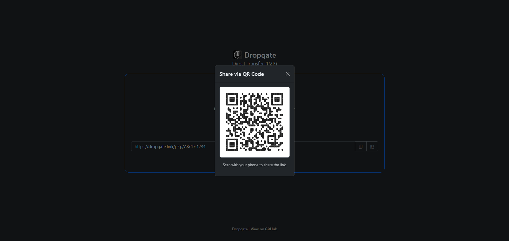
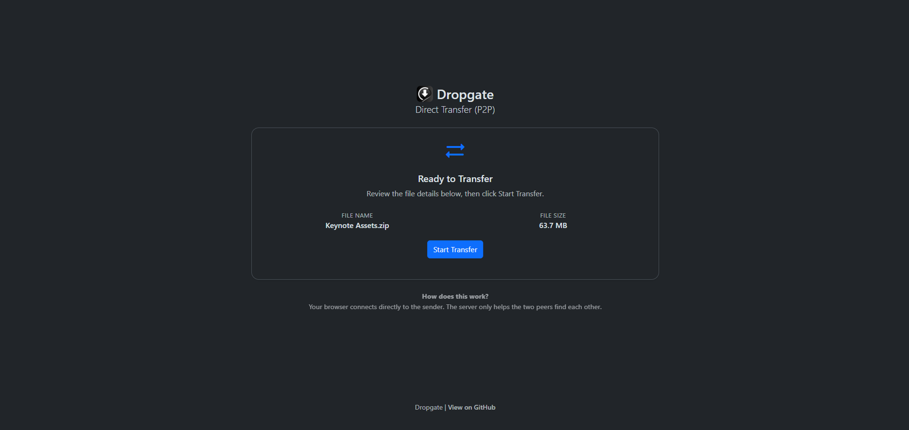

<div align="center">
   

   # Dropgate

   <p style="margin-bottom:1rem;">A self-hosted, privacy-first file sharing system with both hosted upload and direct P2P transfer capabilities.</p>
</div>

<div align="center">


[](https://diamonddigital.dev/discord)
[](https://www.buymeacoffee.com/willtda)

</div>

<div align="center">
  
</div>

## 🩵 Now available on TrueNAS!

**Dropgate Server** is installable from the TrueNAS Apps Market!

See it here: https://apps.truenas.com/catalog/dropgate-server

Learn more: https://diamonddigital.dev/blog/announcing-dropgate-for-truenas

## 🌐 Public Demo

See **Dropgate** in action here: **[dropgate.link](https://dropgate.link)**

To prevent and monitor for abuse, `DEBUG`-level logging and strict rate limits are enforced.

## 🌍 Overview

**Dropgate** is a modern, privacy-respecting file sharing system designed to be easy to self-host and easy to use.

It ships as three parts:
- [**Dropgate Client**](./client/README.md): A lightweight Electron app for uploading, encrypting, and sharing files.
- [**Dropgate Server**](./server/README.md): A Node.js backend that hosts the API + Web UI, with optional end-to-end encryption and configurable storage.
- [**@dropgate/core**](./packages/dropgate-core/README.md): A headless TypeScript library that powers the client and server, usable in custom projects.

Dropgate supports **two ways to transfer files**:
- **Hosted upload (classic mode)** — you upload to your server, share a link, and the server holds the file temporarily.
- **Direct transfer (P2P)** — the file can move device-to-device, with the server only helping peers find each other.

In today’s world, privacy and anonymity are more important than ever.
Dropgate was built to make **secure file sharing accessible**, **transparent**, and **fully self-hostable** — whether on a home NAS, a VPS, or in Docker.


## ✨ Features

- 🔐 **End-to-End Encryption (E2EE)** – Encrypt on the sender device, decrypt on the recipient device. Encryption keys never need to reach the server.
- 🕵️ **Privacy First** – No analytics, no tracking, and no logging of file contents.
- 🔗 **Share Links That “Just Work”** – Simple links for recipients that expire based on download count or lifetime.
- 🚀 **Direct Transfer (P2P)** – Great for big files or “zero-storage” sharing (when enabled).
- 🧩 **Built-in Web UI** – Send and receive from a browser, no install required.
- ⚙️ **Configurable Server Controls** – Tune size limits, rate limits, retention, and storage caps.
- 🧰 **Self-Host Ready** – Works behind common reverse proxies and tunnels.

<div align="center">

| | |
|---------|-----------|
|  |  |
|  |  |
|  |  |

</div>

## 🧰 Project Structure

```
/Dropgate
├── client/                  # Electron-based uploader app (GPL-3.0)
├── server/                  # Node.js server + Web UI (AGPL-3.0)
├── packages/
│   └── dropgate-core/       # Shared TypeScript library (Apache-2.0)
└── docs/                    # Privacy, troubleshooting, and technical notes
```


## 🧩 Getting Started

### Clone the Repository

```bash
git clone https://github.com/diamonddigitaldev/Dropgate.git
cd Dropgate
```

### Client

See the [client README](./client/README.md) for installation, usage, and build instructions.

### Server

See the [server README](./server/README.md) for configuration, Docker setup, and deployment.

### Core Library

See the [core README](./packages/dropgate-core/README.md) for API documentation and usage examples.


## 🔒 Privacy and Security Philosophy

Dropgate’s design is built around **you staying in control of your data**:

* E2EE means even the server operator can’t read encrypted uploads.
* Hosted uploads are intended to be temporary (downloaded and/or expired, then removed).
* Direct transfer can avoid server storage entirely (when enabled).

If you self-host, you decide how strict you want to be — from private-only to public-facing with limits.


## 📚 Docs

- [`docs/PRIVACY.md`](./docs/PRIVACY.md)
- [`docs/TROUBLESHOOTING.md`](./docs/TROUBLESHOOTING.md)
- [`Technical Documentation`](./docs/technical/)


## 📜 Licenses

* **Client:** GPL-3.0 License – See [`client/LICENSE`](./client/LICENSE)
* **Server:** AGPL-3.0 License – See [`server/LICENSE`](./server/LICENSE)
* **Core Library:** Apache-2.0 License – See [`packages/dropgate-core/LICENSE`](./packages/dropgate-core/LICENSE)


## 📖 Acknowledgements

* Logo designed by [TheFuturisticIdiot](https://github.com/TheFuturisticIdiot)
* Built with [Electron](https://www.electronjs.org/) and [Node.js](https://www.nodejs.org/)
* Inspired by the growing need for privacy-respecting, open file transfer tools


### AI Disclosure

This project uses AI tools to aid development.

AI is used to:
- Plan significant changes
- Implement initial passes of new features
- Perform security audits (alongside human review)
- Fix bugs and patch security vulnerabilities
- Review pull requests (alongside human review)

AI is NOT used to:
- Design UI/UX
- Design visual assets (such as bitmap and vector graphics)
- Triage issues
- Decide project direction
- Create release information

AI has a tendency to hallucinate/produce plausible but suboptimal, inaccurate or misleading solutions to delegated tasks.

Every commit is manually reviewed and approved by a member of Diamond Digital Development, and testing is carried out to ensure changes work as intended, do not introduce regressions, and meet reliability and security expectations before being merged into the `master` branch.


## 🙂 Contact Us

* 💬 **Need help or want to chat?** [Join our Discord Server](https://diamonddigital.dev/discord)
* 🐛 **Found a bug?** [Open an issue](https://github.com/diamonddigitaldev/Dropgate/issues)
* 💡 **Have a suggestion?** [Submit a feature request](https://github.com/diamonddigitaldev/Dropgate/issues/new?labels=enhancement)


<div align="center">
  <a href="https://diamonddigital.dev/">
  <strong>Created and maintained by</strong>
  </a>
</div>