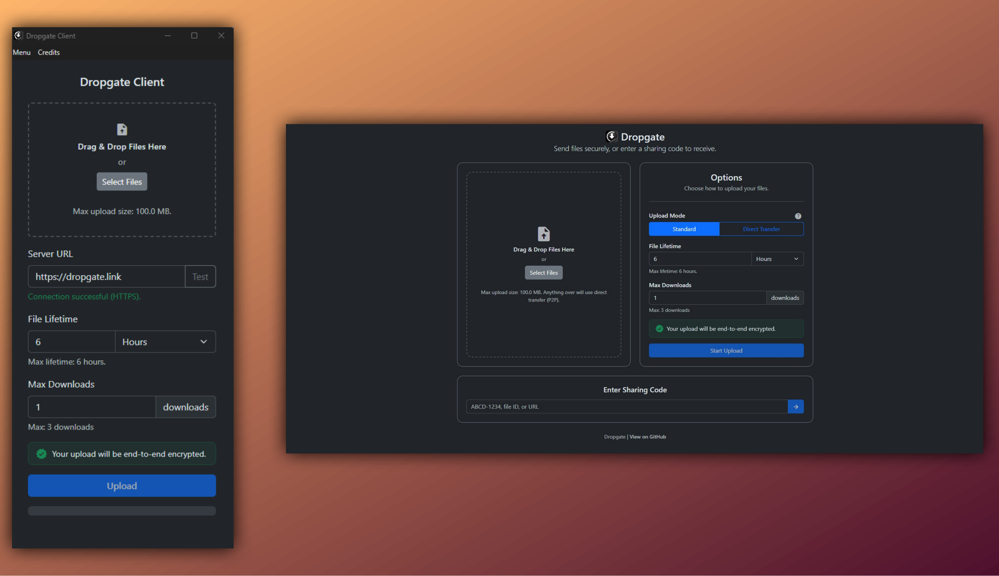
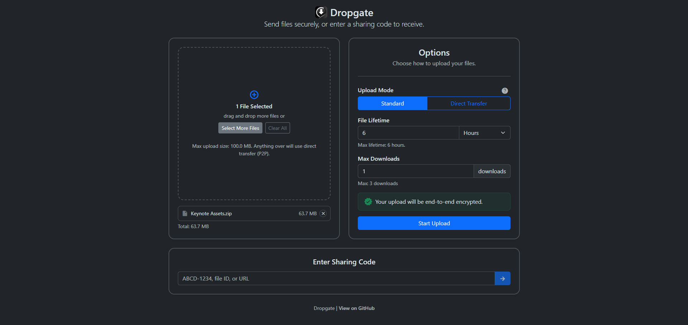
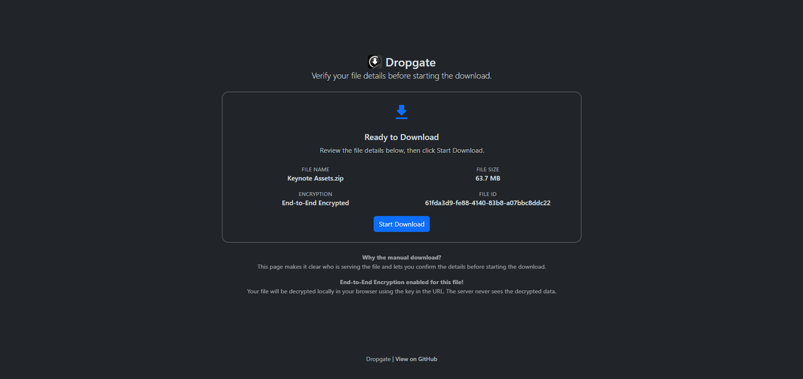
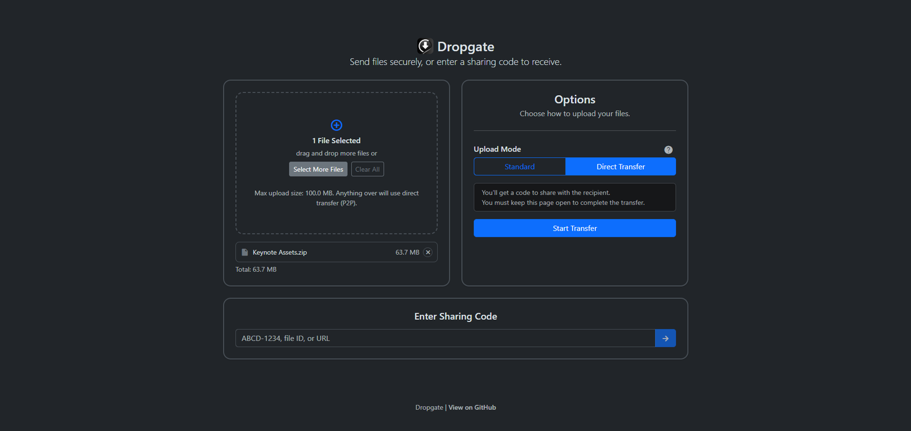
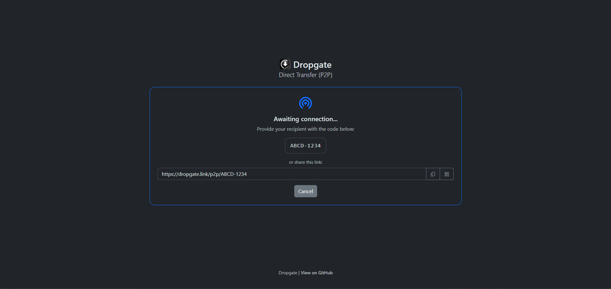
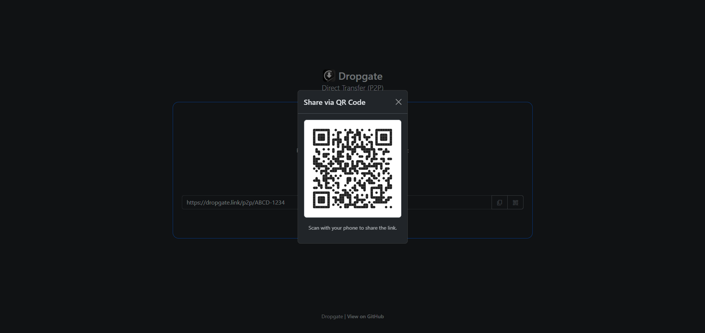
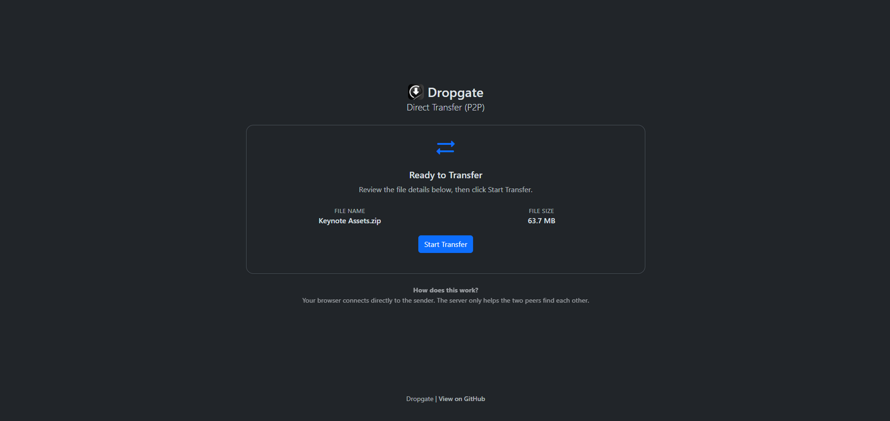

<div align="center">
   

   # Dropgate

   <p style="margin-bottom:1rem;">A self-hosted, privacy-first file sharing system with both hosted upload and direct P2P transfer capabilities.</p>
</div>

<div align="center">


[](https://diamonddigital.dev/discord)
[](https://www.buymeacoffee.com/willtda)

</div>

<div align="center">
  
</div>


## Available on TrueNAS and umbrelOS

Install **Dropgate Server** on your favourite home server platform:

| Platform | Install | Learn more |
|----------|---------|------------|
| **TrueNAS** | [Apps Market →](https://apps.truenas.com/catalog/dropgate-server) | [Announcement](https://diamonddigital.dev/blog/announcing-dropgate-for-truenas) |
| **umbrelOS** | [App Store →](https://apps.umbrel.com/app/dropgate-server) | [Announcement](https://diamonddigital.dev/blog/announcing-dropgate-for-umbrelos) |

## Public Demo

See **Dropgate** in action here: **[dropgate.link](https://dropgate.link)**

To prevent and monitor for abuse, `DEBUG`-level logging and strict rate limits are enforced.

## Overview

**Dropgate** is a modern, privacy-respecting file sharing system designed to be easy to self-host and easy to use.

It ships as three parts:
- [**Dropgate Client**](./client/README.md): A lightweight Electron app for uploading, encrypting, and sharing files.
- [**Dropgate Server**](./server/README.md): A Node.js backend that hosts the API + Web UI, with optional end-to-end encryption and configurable storage.
- [**@dropgate/core**](./packages/dropgate-core/README.md): A headless TypeScript library that powers the client and server, usable in custom projects.

Dropgate supports **two ways to transfer files**:
- **Hosted upload (classic mode)** — you upload to your server, share a link, and the server holds the file temporarily.
- **Direct transfer (P2P)** — the file can move device-to-device, with the server only helping peers find each other.

In today’s world, privacy and anonymity are more important than ever.
Dropgate was built to make **secure file sharing accessible**, **transparent**, and **fully self-hostable** — whether on a home NAS, a VPS, or in Docker.


## Features

- **End-to-End Encryption (E2EE)** – Encrypt on the sender device, decrypt on the recipient device. Encryption keys never need to reach the server.
- **Privacy First** – No analytics, no tracking, and no logging of file contents.
- **Share Links That “Just Work”** – Simple links for recipients that expire based on download count or lifetime.
- **Direct Transfer (P2P)** – Great for big files or “zero-storage” sharing (when enabled).
- **Built-in Web UI** – Send and receive from a browser, no install required.
- **Configurable Server Controls** – Tune size limits, rate limits, retention, and storage caps.
- **Self-Host Ready** – Works behind common reverse proxies and tunnels.

<div align="center">

| | |
|---------|-----------|
|  |  |
|  |  |
|  |  |

</div>

## Project Structure

```
/Dropgate
├── client/                  # Electron-based uploader app (GPL-3.0)
├── server/                  # Node.js server + Web UI (AGPL-3.0)
├── packages/
│   └── dropgate-core/       # Shared TypeScript library (Apache-2.0)
├── tests/
│   ├── docs/                # Checks that the docs' links and names match the repository (AGPL-3.0)
│   └── integration/         # End-to-end tests of the Web UI and the client, with Playwright (AGPL-3.0)
└── docs/                    # Privacy, troubleshooting, and technical notes
```

Each part has its own tests. See the READMEs linked below, and the [integration tests README](./tests/integration/README.md) for the end-to-end tests of the Web UI and the client. The [docs checks](./tests/docs/README.md) check that every link in the READMEs and the docs leads somewhere, and that the environment variables, endpoints and error codes they name match the code.


## Getting Started

### Clone the Repository

```bash
git clone https://github.com/diamonddigitaldev/Dropgate.git
cd Dropgate
```

### Client

See the [client README](./client/README.md) for installation, usage, and build instructions.

### Server

See the [server README](./server/README.md) for configuration, Docker setup, and deployment.

### Core Library

See the [core README](./packages/dropgate-core/README.md) for API documentation and usage examples.


## Privacy and Security Philosophy

Dropgate’s design is built around **you staying in control of your data**:

* E2EE means even the server operator can’t read encrypted uploads.
* Hosted uploads are intended to be temporary (downloaded and/or expired, then removed).
* Direct transfer can avoid server storage entirely (when enabled).

If you self-host, you decide how strict you want to be — from private-only to public-facing with limits.


## Docs

- [`docs/PRIVACY.md`](./docs/PRIVACY.md)
- [`docs/TROUBLESHOOTING.md`](./docs/TROUBLESHOOTING.md)
- [`Technical Documentation`](./docs/technical/)

GitHub Actions checks their links, and the names they give, against the code on every push and pull request ([docs checks](./tests/docs/README.md)).


## Releases

Core, the server and the client share one version, and are released together, from a tag that is that version (such as `3.0.13`). The version is changed by hand, in one commit, in each part's `package.json` and `package-lock.json`, and in the version badge at the top of its README. On every push and pull request, GitHub Actions checks that they all give the same version, and fails if one doesn't ([`check-versions.mjs`](./.github/scripts/check-versions.mjs)).

Each release is built and published from its tag by one workflow, [`release.yml`](./.github/workflows/release.yml), when its GitHub release is published. In order:

* it checks that the release's target is `master`, or `4.0.0` until that's merged, and that the tag's commit is on that branch;
* it checks that the release's tag is the version, and that the release is a pre-release exactly when the version has a pre-release part, such as `4.0.0-alpha.1`, so a pre-release can never become the latest release;
* it looks the version up on npm, which never takes a version twice, and stops there if npm already has it, before anything is attached, pushed or published;
* it runs every test and builds the client, as CI does;
* it builds the client again on Windows and on Ubuntu, and attaches each platform's files to the release, straight from the build that made them: the NSIS installer and its `.blockmap`, the AppImage, the `.deb` and the `.rpm` ([`desktop-release-files.mjs`](./.github/scripts/desktop-release-files.mjs)). Any other file the build writes fails the run, until it's decided whether a release attaches it;
* it makes the server's and core's source archives, `dropgate-server-<version>.tar.gz` and `dropgate-core-<version>.tar.gz`: each folder as it is at the release's commit, from `git archive`, with its line endings as committed and every file dated at that commit, so the same commit gives the same archive on any machine (see below). Each is unpacked on its own, away from the repository, then installed and tested (core is also typechecked and built), so each stands alone. Then both are attached;
* it builds the server's Docker image for `linux/amd64` and `linux/arm64`, checks each platform's image as CI checks its own (below), and pushes it to `willtda/dropgate-server` with the release's tags. A stable release is tagged with its version, its major and minor version, its major version and `latest` (`4.0.0`, `4.0`, `4` and `latest`). A pre-release is tagged only with its version and `next` (`4.0.0-alpha.1` and `next`), never `latest`. Then every tag must name the image just pushed, with both platforms, and each platform's image, pulled back from Docker Hub, is checked again;
* it attaches the client's update files, `latest.yml` for Windows and `latest-linux.yml` for Linux, which the installed app reads to update itself, after every other file and the image, so the app never finds one before everything it names is there. Each must name only files its own build attached, with the same size and SHA-512. A pre-release attaches neither, so the app never updates to one;
* last of all, it stages core on npm, tagged `latest` for a stable release and `next` for a pre-release, with provenance, through npm's trusted publishing: npm swaps the job's GitHub ID token for a token that can only stage `@dropgate/core`, so GitHub keeps no npm token. **Nothing is on npm until a maintainer approves it there, with two-factor authentication** (on npmjs.com, or with `npm stage approve`). First it checks what provenance needs ([`check-npm-provenance.mjs`](./.github/scripts/check-npm-provenance.mjs)): npm 11.15.0 or later, the package's `repository` naming this repository and its folder, the repository and the package public, and the workflow being `release.yml`.

Each file attached is then checked against GitHub's own size and SHA-256 for it, and a file the release already has is never replaced: the job fails instead ([`attach-release-files.sh`](./.github/scripts/attach-release-files.sh)). To run a job that attaches files again, delete its files from the release first. Since the files are attached after the release is published, the repository's immutable releases setting stays off. Nothing is uploaded as a workflow artifact.

A release's source archive can be made again from its tag, to compare with the one attached. For the server's (core's is `packages/dropgate-core`, named `dropgate-core-`):

```bash
v=4.0.0-alpha.1
git -c core.autocrlf=false archive --format=tar.gz --prefix=dropgate-server-$v/ --mtime="$(git log -1 --format=%cI $v)" -o dropgate-server-$v.tar.gz $v:server
```

A job's permissions can't depend on what started it, so each job that attaches, pushes or publishes has a copy that only a published release runs, with the permissions it needs, and that runs the dry run's own steps first (below). The image and npm jobs run in the repository's `release` environment, which only a tag can deploy to: it holds the Docker Hub secrets, and npm's trusted publisher for `@dropgate/core` names it, with this repository and `release.yml`, and allows staging only.

The workflow's dry run does everything but attach, push and publish, with a read-only token and no ID token:

* it checks that it's run from `master` or `4.0.0`, and the versions against the release the packages' version would make;
* while npm already has the version, as it has `3.0.13`, it warns and goes on;
* it lists every file the release would attach, with their sizes and SHA-256, and the tags it would push, and builds and checks everything as a release does;
* last of all, it runs npm's dry run of publishing core, which lists every file in the package. While npm has the version, it passes `--force`, which skips only npm's own checks against the registry. npm's dry run skips provenance, so the run checks what provenance needs without asking for a token: given one, npm would swap it for a real token, even in a dry run.

The dry run runs by itself on a push that changes `release.yml`, and by hand, where it can pretend a tag and pre-release flag to show what the checks would say:

```bash
gh workflow run release.yml --ref 4.0.0
gh workflow run release.yml --ref 4.0.0 -f tag=4.0.0-alpha.1 -f prerelease=yes
```

On every push and pull request, GitHub Actions also builds the server's Docker image and checks it ([`check-server-image.sh`](./.github/scripts/check-server-image.sh)): it must carry core's build, `server/public/js/dropgate-core.js`, and the server's license, `server/LICENSE`, byte for byte; its `org.opencontainers.image.licenses` label must be the license `server/package.json` gives; and when it's started, with a port on `127.0.0.1` only, it must answer `GET /api/info` with the server's version and pass its health check.


## Licenses

* **Client:** GPL-3.0 License – See [`client/LICENSE`](./client/LICENSE)
* **Server:** AGPL-3.0 License – See [`server/LICENSE`](./server/LICENSE)
* **Core Library:** Apache-2.0 License – See [`packages/dropgate-core/LICENSE`](./packages/dropgate-core/LICENSE)


## Acknowledgements

* Logo designed by [TheFuturisticIdiot](https://github.com/TheFuturisticIdiot)
* Built with [Electron](https://www.electronjs.org/) and [Node.js](https://www.nodejs.org/)
* Inspired by the growing need for privacy-respecting, open file transfer tools


### AI Disclosure

This project uses AI tools to aid development. Read our [AI Transparency & Quality Commitment](https://diamonddigital.dev/ai-transparency) statement for more information.


## Contact Us

* **Need help or want to chat?** [Join our Discord Server](https://diamonddigital.dev/discord)
* **Found a bug?** [Open an issue](https://github.com/diamonddigitaldev/Dropgate/issues)
* **Have a suggestion?** [Submit a feature request](https://github.com/diamonddigitaldev/Dropgate/issues/new?labels=enhancement)


<div align="center">
  <a href="https://diamonddigital.dev/">
  <strong>Created and maintained by</strong>
  </a>
</div>